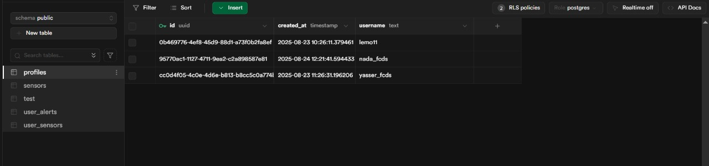
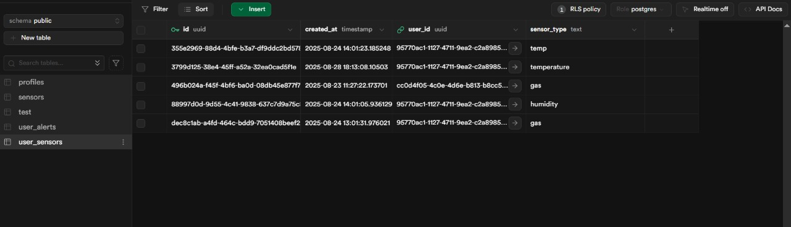
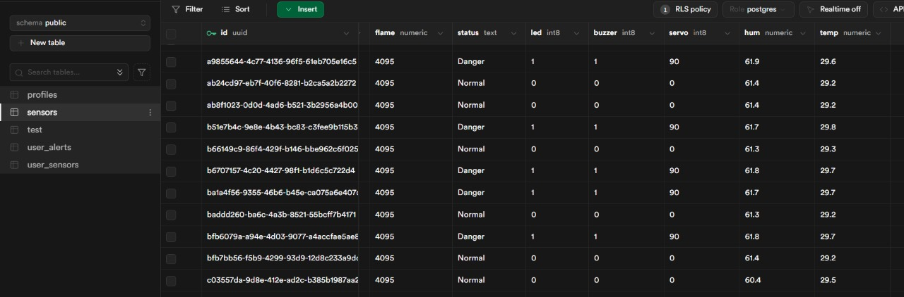
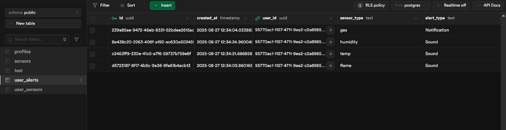

# 🍳 Smart Kitchen Safety & Monitoring System

An IoT-based solution for kitchen safety that monitors gas, flame, and temperature sensors, and provides real-time alerts with remote control features.

---

## 📊 Project Presentation
📄 [View Presentation (PDF)](presentation.pdf)
---
## 📊 Project report
📄 [View Report (PDF)](TEAM 10.pdf)
---

## 🖼️ Circuit Design
Here is the Wokwi circuit design:

---

## 🎥 Simulation Video
Watch the simulation video:  
[▶️ Watch Simulation](simulation%20video.mp4)

---

## 📱 Mobile App Screens
### Screenshots of the Flutter App:
- **Login Screen**  
  

- **Dashboard**  
  

- **Alerts Page**  
  

- **Sensor Logs**  
  

---

## 📈 Flow Diagram
System workflow:

---

## ☁️ HiveMQ Setup
- **Message & Topics**  
  .png)

- **Connection Setup**  
  

---

## 🔗 Node-RED Flow
Visualization of Node-RED integration:

---

## 🚀 Features
- ✅ Gas, Flame, and Temperature Monitoring  
- ✅ Real-time Alerts  
- ✅ Remote Door Control  
- ✅ Dashboard with Logs & History  

---

## 🛠️ Tools & Tech
- **ESP32**  
- **MQTT (HiveMQ, Dioty)**  
- **Node-RED & Grafana**  
- **Supabase (Auth & Database)**  
- **Flutter (Mobile App)**  

---
