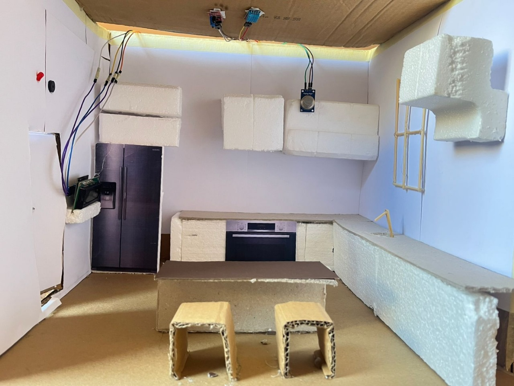

# 🍳 Smart Kitchen Safety & Monitoring System  

> **"Tomorrow: your reward for working safely today."**  

This principle highlights the importance of proactive safety measures in daily life.  
Kitchen safety, in particular, is a major concern due to risks such as:  

- 🔥 Fire hazards  
- 🏭 Gas leaks  
- ⚡ Overheating appliances  

Conventional systems often lack real-time monitoring and automation, which delays hazard detection and increases the likelihood of accidents.  

---

## ✅ Our Solution  

This project proposes a **Smart Kitchen Safety & Monitoring System** powered by an **ESP32 microcontroller**.  

It integrates:  
- 🔹 **MQ2 Gas Sensor** – detects leaks (300–10,000 ppm)  
- 🔹 **Flame Sensor** – identifies infrared radiation from potential fires  
- 🔹 **DHT11 Sensor** – monitors temperature & humidity  
- 🔹 **Servo Motor** – automatically opens/closes the kitchen door  
- 🔹 **LED & Buzzer** – provide instant local alerts  
- 🔹 **LCD Display** – shows real-time status  

---

## ⚙️ How It Works  

### 🔄 System Workflow  
1. **IoT Sensors** → Monitor gas, flame, temperature, humidity.  
2. **ESP32 Microcontroller** → Compares readings to thresholds.  
   - If exceeded → activates alarms (LED, buzzer, servo motor).  
3. **MQTT Broker (HiveMQ)** → ESP32 publishes sensor data to topics.  
4. **Node-RED** → Subscribes, processes data, triggers alerts, and stores readings in Supabase.  
5. **Supabase Database** → Stores logs & manages authentication.  
6. **Flutter Mobile App** → Displays live values, door status, danger/safe alerts, and history.  
7. **Actuators** → Servo closes kitchen door during hazards.  
8. **Kitchen Maquette** → Physical prototype simulating real kitchen.  

---

## 🌍 Contribution to SDGs  

This project supports:  
- **Good Health & Well-Being (SDG 3)** – reducing household accidents.  
- **Sustainable Cities & Communities (SDG 11)** – safer homes through smart IoT systems.  

---

## 📑 Project Report  
📄 [TEAM 10 Project Report (PDF)](TEAM%2010.pdf)  

---

## 📊 Project Presentation  
📄 [View Presentation (PDF)](presentation.pdf)  

---

## 🖼️ Circuit Design  
Here is the Wokwi circuit design:  

  

---

## 🎥 Simulation Video  
Watch the simulation video:  
[▶️ Watch Simulation](simulation%20video.mp4)  

---

## 📱 supabase Screens  
 
- **Login Screen**  
    

- **Dashboard**  
    

- **Alerts Page**  
    

- **Sensor Logs**  
    

---

## 🏠 Kitchen Maquette  

Our physical prototype:  

- **Maquette View 1**  
    

- **Maquette View 2**  
    

---

## 📈 Flow Diagram  
System workflow:  

  

---

## ☁️ HiveMQ Setup  
- **Message & Topics**  
  .png)  

- **Connection Setup**  
    

---

## 🔗 Node-RED Flow  
Visualization of Node-RED integration:  

  

---

## 🚀 Features  
- ✅ Gas, Flame, and Temperature Monitoring  
- ✅ Real-time Alerts  
- ✅ Remote Door Control  
- ✅ Dashboard with Logs & History

## 🎥 Demo Videos
- [▶️ Demo Video 1](de.mp4)  
- [▶️ Demo Video 2](dem.mp4)  
- [▶️ Demo Video 3](demo3.mp4)  

---
